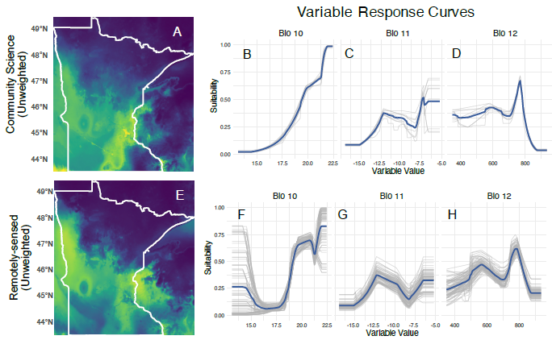

# Leafy Spurge Demography: Remote Sensing Analysis

This repo contains code for training and testing temporal convolutional neural networks and species distribution models described in this paper: Lake, Thomas; Briscoe Runquist, Ryan; & Moeller, David. (2026). Two decades of Landsat images reveal spatial and temporal dynamics of invasion and improve species distribution models. Ecological Applications, X(X), XXX-XXX. DOI: XXX

Data supporting this paper are available through the Data Repository for the University of Minnesota (DRUM): https://doi.org/10.13020/ba6e-yt29

## Introduction

Despite a growing understanding of the mechanisms and consequences of biological invasions, forecasting the spread of introduced populations remains challenging. This repository focuses on leveraging remote sensing techniques for cost-effective strategies to locate and predict the spread of invasive species.

## Remote Sensing and Species Distribution Models (SDMs)

This repository explores the benefits of remote sensing, particularly satellite imagery, as a powerful tool for collecting information on the spatial distribution and population trends of invasive species. The focus is on developing convolutional neural networks that integrate time-series remote sensing data to enhance the accuracy of predictions.

## Study Focus: Leafy Spurge

We concentrate on leafy spurge (Euphorbia virgata; Euphorbiaceae) in Minnesota, USA. Leafy spurge is among the most economically damaging invasive plant in the US, with total costs exceeding $1 billion. The study uses Landsat time-series scenes from 2000 to 2020 to build deep learning convolutional neural networks, incorporating remote sensing data for predicting the probability of occurrence and inferring population growth/decline.

## Repository Structure

- Python files (.py) include code for preparing Landsat data, for creating training datasets, and for training and evaluating a temporal convolutional neural network.
- CSV (.csv) file includes an example training dataset for the temporal convolutional neural network.
- `temporalCNN/`: Code for the temporal Convolutional Neural Network (forked from https://github.com/charlotte-pel/temporalCNN)
- `LICENSE`: Repository license information.

